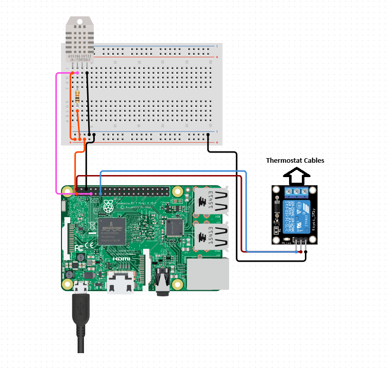
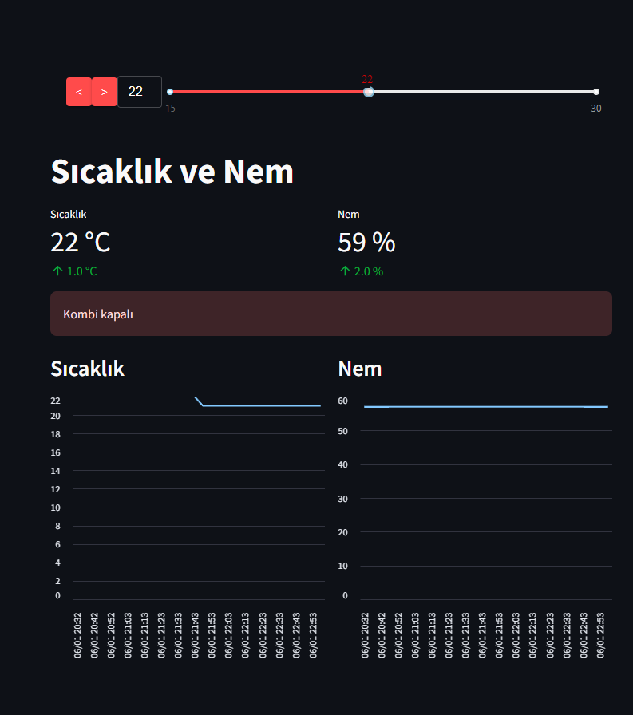

# Heating System Automation


This project is a thermostat system that utilizes Raspberry Pi with a web-based interface to control indoor temperature instead of a mechanical thermostat. Additionally, the system maintains statistics of the home temperature.

## Features

- Developed using Raspberry Pi 4.
- Integrated DHT11 temperature and humidity sensor.
- Control of the heating system through a single-channel relay.
- Developed using Python.
- MySQL utilized for the database.
- Temperature data is measured at specified intervals and stored in the MySQL database.
- User interface designed using the Streamlit library.

## Requirements

To run the project, the following components are required:

- Raspberry Pi 4
- DHT11 Temperature and Humidity Sensor
- Single-channel Relay
- Python 3.x
- MySQL Database

## Installation

1. Cloning the project:
    ```bash
    git clone https://github.com/user/Heating-System-Automation.git
    cd Heating-System-Automation
    ```

2. Installing necessary Python libraries:
    ```bash
    pip install -r requirements.txt
    ```

3. Setting up and configuring the MySQL database (e.g., passwords, database name, etc.).

4. Running the project:
    ```bash
    python app.py
    ```

## Usage

1. Once the project is running, navigate to `http://localhost:8501` from your web browser.
2. You can view temperature statistics and control the thermostat from the main interface.

## Project Diagram



## Screen Capture



## Contribution

1. Fork this repository (`Heating-System-Automation`).
2. Create a new branch for new features or fixes: `git checkout -b feature/NewFeature`
3. Commit your changes: `git commit -am 'New feature: Description'`
4. Push your branch: `git push origin feature/NewFeature`
5. Open a Pull Request (PR).

## License

This project is licensed under the MIT License. Refer to the [`LICENSE`](LICENSE) file for more information.


